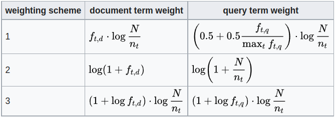

# Persian News Search Engine
A search engine for crawling news from the web, storing in a structured way, and querying through the stored
documents for finding the most relevant results using Machine Learning and Information Retrieval techniques.

## Instructions to run the search engine
Before running the server, you need to install the required packages. To do that, create a virtual 
environment and run 
```
$ pip install -r requirements.txt
```
The version of python used is `3.8.10`. Before running the search engine for the first time, issue
the following command:
```
$ python manage.py migrate
```
For running the search engine, use the following command:
```
$ python manage.py runserver
```

## Details of Implementation
This search engine is designed to retrieve the most relevant documents given a query by the user. The 
steps of implementation are comprised of 1) indexing and storing documents, 2) querying through documents.

### Indexing 
When a document is received, first, some preprocessing steps, including *Normalization*, *Tokenization*,
*Stemming*and Removing stop words are done. Then the document is stored as a vector. We need to accept a weighting scheme for weighting words within a document and vectorize it. For this purpose, 
[TF-IDF](https://en.wikipedia.org/wiki/Tf%E2%80%93idf) method is used. 

### Querying
When the user provides a query, the query is converted to a vector using the same process as used
for documents (TF-IDF). Then the similarity of the query to each document is calculated using the 
[Cosine similarity](https://en.wikipedia.org/wiki/Cosine_similarity). Then, *K* most similar documents to the query
are returned.

According to Wikipedia, we can have different weighting scheme combinations for queries and documents. 
The weighting schemes we have implemented are as shown in the following table:



*Different weighting schemes for converting documents and queries to vectors*

In this table, $f_{t, d}$ is the number of repetitions of the word $t$ in document $d$, $f_{t, q}$ is the repetition of 
$t$ in query $q$, and $n_t$ is the number of documents containing word $t$.

### Efficient search using Machine Learning techniques
As discussed, the relevant documents are retrieved based on their Cosine similarity with the query. However, we have a 
large number of documents, and comparing the query with each document and returning the most relevant ones is not an efficient 
method. For this reason, we use clustering techniques to cluster the documents and compare each query only to the centers
of the cluster. The most relevant clusters are then retrieved, and the query is compared to the documents of those clusters.
For clustering the documents, we need to specify the number of clusters. To do that, we apply the 
[Residual Sum of Squares (RSS)](https://en.wikipedia.org/wiki/Residual_sum_of_squares) method.

The search can also be done in a specific category of documents. The category should be given in the query by `cat:<category name>`
To search through the categories, first, we should perform classification over documents. For this purpose, we categorize all
the News to 8 classes: **Science**, **Culture-Art**, **Politics**, **Economy**, **Social**, **International**, **Sport**, and **Multimedia**.
Since classification is a supervised method, we require to have labeled data. Therefore, we labeled some documents
and classified them using the [KNN](https://en.wikipedia.org/wiki/K-nearest_neighbors_algorithm) algorithm.

###  Online crawler
The most simple algorithm for crawling is as follows:  
- Define a queue of initial URLs which acts as the seed.
- forever:
    - link = queue.front()
    - queue.pop()
    - content = GET(link)
    - Update the index with content
    - for every sub_link in content that is **unvisited**:
        - queue.push(sub_link)

There are a bunch of problems with the algorithm mentioned above, and many improvements are available:  
- How to restart from the last state of the queue after shutting down the crawler?
- How to property handle duplicated (visited) links?
- Crawler should visit some web pages repeatedly. For example, a news agency website. How to implement this mechanism? What is the proper rate of visit for each link?
- How to prevent bombarding a server that should be visited repeatedly?
- How to launch multiple instances of the crawlers working collaboratively in a distributed manner? The critical part is synchronization.
- How to properly parse an HTML page? Just remove HTML tags or do further processing?
-,...

As you see, there are a hundred or even thousands of challenging technical problems. Trying to maximize the performance of a part of the crawler as a solution to a problem may reduce the performance of the other part (No free launch!).
